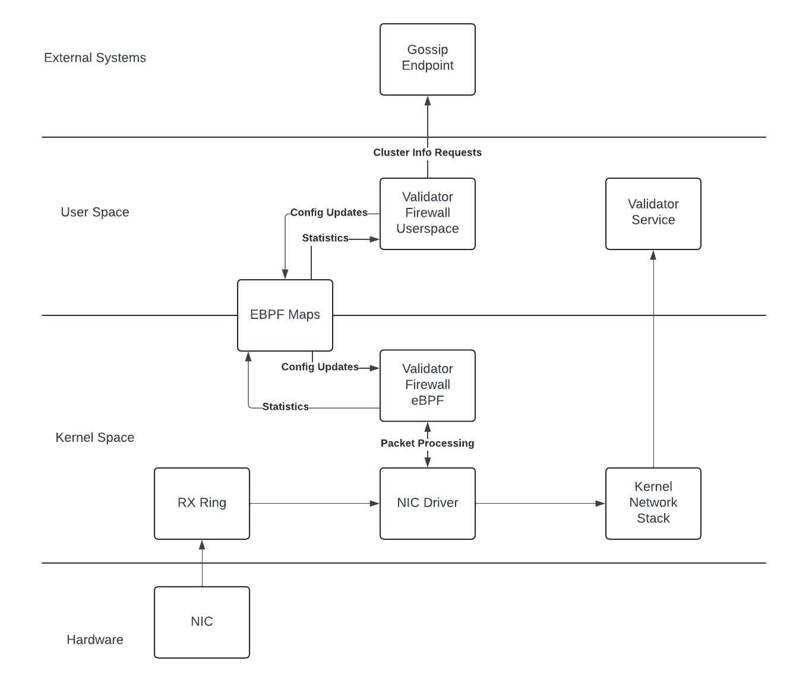

 # Validator Firewall

Low level blocking for validator nodes. This project is a work in progress and interfaces may change.




## Prerequisites

1. Install nightly components: `rustup toolchain install nightly --component rust-src`
2. Install bpf-linker: `cargo install bpf-linker`

### Caveats for Ubuntu 20.04

There is a bug with bpftool and the default kernel installed by the distribution. To avoid running into it, you can install a newer bpftool version that does not include the bug with:

```
sudo apt install linux-tools-5.8.0-63-generic
export PATH=/usr/lib/linux-tools/5.8.0-63-generic:$PATH
```

Bond interfaces are not supported.

## General Structure

The project is split into two main components: an eBPF program that runs in the context of the network driver and a 
userspace program that configures it.  The raw bytes of the eBPF program are linked into the userspace program and 
the executable is loaded into the kernel on start. The userspace program is responsible for setting up the eBPF 
maps (shared memory between the eBPF program and the userspace program), pushing in external data, and reporting stats.

By default, all non-gossip traffic is blocked on protected ports.  Additional hosts can be configured to be allowed when
not in gossip, or denied (even when in gossip).  This is configured via a static overrides file using the following format:

```yaml
allow:
  - name: "host1"
    ip: 1.2.3.4
  - name: "host2"
    ip: 4.5.6.7
deny:
  - name: "spammer"
    ip: 8.9.10.11
```

## Build eBPF

```bash
cargo xtask build-ebpf
```

To perform a release build you can use the `--release` flag.
You may also change the target architecture with the `--target` flag.

## Build Userspace

```bash
cargo build
```

## Run

```bash
#If -p is not specified, we only act on 8009, 8010 
RUST_LOG=info cargo xtask run --release -- --iface <iface> --static-overrides <path_to_static_overrides.yaml> -p 8004 -p 8005 -p 8006
```
## Leader Schedule Aware Blocking

By default, the firewall will attempt to determine the identity of the validator by looking at "getIdentity" from the given
RPC endpoint (default: http://localhost:8099).  If an external RPC endpoint is specified, the identity of the validator
being protected *MUST* be provided, or the firewall will not be able to determine if the validator is the leader or not.

## Production
This should be run under a user with the CAP_NET_ADMIN capability. This is required to load the eBPF program and to set the XDP program on the interface.

The `install_service.sh` script (uses sudo) can create a basic systemd unit file and overrides config.

## Developing on this Project

In general, the eBPF component should be as lightweight and as fast as possible.  It's in the datapath, so we need to do as little  work there as we can.

Some background reading on why XDP: [How to Drop 10M Packets per Second](https://blog.cloudflare.com/how-to-drop-10-million-packets)

This project heavily uses [Aya](https://aya-rs.dev/book/). 


